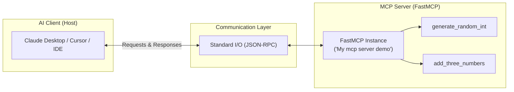

# 🚀 FastMCP Demo Server

[](https://www.python.org/)
[](https://github.com/jlowin/fastmcp)
[](https://modelcontextprotocol.io/)
[](https://github.com/astral-sh/uv)
[](LICENSE)

A lightweight, robust, and extensible **Model Context Protocol (MCP)** server built with Python and [FastMCP](https://github.com/jlowin/fastmcp). This project demonstrates how to expose native Python functions as tools directly to AI assistants like Claude Desktop, Cursor, and other MCP-compatible clients.

---

## 📋 Table of Contents

- [Overview](#-overview)
- [Architecture](#-architecture)
- [Available Tools](#-available-tools)
- [Project Structure](#-project-structure)
- [Prerequisites](#-prerequisites)
- [Installation & Setup](#-installation--setup)
- [Running & Testing](#-running--testing)
  - [1. Direct Execution (Stdio)](#1-direct-execution-stdio)
  - [2. FastMCP Inspector (Interactive UI)](#2-fastmcp-inspector-interactive-ui)
- [Connecting to MCP Clients](#-connecting-to-mcp-clients)
  - [Claude Desktop](#claude-desktop)
  - [Cursor / VS Code MCP Extensions](#cursor--vs-code-mcp-extensions)
- [Extending the Server](#-extending-the-server)
- [Troubleshooting](#-troubleshooting)
- [License](#-license)

---

## 🌟 Overview

The **Model Context Protocol (MCP)** is an open standard that enables AI models to safely interact with local data sources, APIs, and computation tools.

This repository provides a clean starter template using **FastMCP**, an intuitive framework for writing MCP servers in Python. It includes:
- **Type-safe tools** with automatic schema generation from Python docstrings and type hints.
- **Fast, modern dependency management** with [`uv`](https://docs.astral.sh/uv/).
- **Standard input/output (stdio)** transport for easy integration with desktop and CLI LLM hosts.

---

## 🏛 Architecture



---

## 🛠 Available Tools

The server registers the following tools automatically:

| Tool Name | Parameters | Return Type | Description |
| :--- | :--- | :--- | :--- |
| `generate_random_int` | `min_value` *(int)*<br>`max_value` *(int)* | `int` | Generates a pseudo-random integer in the range `[min_value, max_value]`. |
| `add_three_numbers` | `a` *(int)*<br>`b` *(int)*<br>`c` *(int)* | `int` | Computes the arithmetic sum of three numbers: `a + b + c`. |

### Example Schema & Tool Usage

```python
# 1. Random Number Generation
generate_random_int(min_value=1, max_value=100)
# Output: 42

# 2. Arithmetic Addition
add_three_numbers(a=10, b=25, c=15)
# Output: 50
```

---

## 📂 Project Structure

```text
MCP-demo/
├── my_server.py                # Server entry point defining tools & FastMCP instance
├── pyproject.toml              # Project configuration and dependencies
├── requirements.txt            # Traditional pip dependency list
├── uv.lock                     # Deterministic lockfile for uv package manager
├── src/
│   └── mcp_demo_server/        # Package module namespace
│       └── __init__.py
└── README.md                   # Project documentation
```

---

## ⚙️ Prerequisites

- **Python**: Version `3.10` or higher (`>= 3.12` / `3.14` recommended).
- **uv** (Recommended): Modern, ultra-fast Python package installer and runner ([Install uv](https://docs.astral.sh/uv/getting-started/installation/)).
  ```powershell
  # Windows (PowerShell)
  powershell -ExecutionPolicy ByPass -c "irm https://astral.sh/uv/install.ps1 | iex"
  ```
  *Alternatively, standard `pip` and Python `venv` work as well.*

---

## 🚀 Installation & Setup

### Option A: Using `uv` (Recommended)

1. **Clone the repository:**
   ```bash
   git clone https://github.com/victorjanni/MCP.git
   cd MCP
   ```

2. **Sync dependencies:**
   `uv` will automatically create the virtual environment and install all locked dependencies:
   ```bash
   uv sync
   ```

### Option B: Using Standard `pip` and Virtualenv

1. **Create and activate a virtual environment:**
   ```powershell
   # Windows PowerShell
   python -m venv .venv
   .\.venv\Scripts\Activate.ps1
   ```
   ```bash
   # macOS / Linux
   python3 -m venv .venv
   source .venv/bin/activate
   ```

2. **Install dependencies:**
   ```bash
   pip install -r requirements.txt
   ```

---

## 💻 Running & Testing

### 1. Direct Execution (Stdio)

To start the server in stdio mode (used by MCP clients):

```bash
# Using uv
uv run python my_server.py

# Using active virtual environment
python my_server.py
```
> [!NOTE]
> When run directly, the server listens for JSON-RPC messages via `stdin`/`stdout`. To interact with it manually, use the FastMCP Inspector below.

### 2. FastMCP Inspector (Interactive UI)

FastMCP includes an interactive developer inspector web UI that lets you inspect schemas and test tool invocations in your browser:

```bash
uv run fastmcp dev my_server.py
```

This will spin up a local development UI where you can invoke `generate_random_int` and `add_three_numbers` with custom inputs and view real-time responses.

---

## 🔌 Connecting to MCP Clients

### Claude Desktop

To use this server with Claude Desktop, add it to your configuration file:

- **Windows**: `%APPDATA%\Claude\claude_desktop_config.json`
- **macOS**: `~/Library/Application Support/Claude/claude_desktop_config.json`

Add the following entry under `"mcpServers"`:

#### Using `uv` (Recommended):
```json
{
  "mcpServers": {
    "mcp-demo-server": {
      "command": "uv",
      "args": [
        "--directory",
        "E:\\MCP-demo",
        "run",
        "python",
        "my_server.py"
      ]
    }
  }
}
```

#### Using Virtual Environment Python:
```json
{
  "mcpServers": {
    "mcp-demo-server": {
      "command": "E:\\MCP-demo\\.venv\\Scripts\\python.exe",
      "args": [
        "E:\\MCP-demo\\my_server.py"
      ]
    }
  }
}
```

> [!TIP]
> On Windows, remember to escape backslashes in JSON strings (use `\\` instead of `\`), or use forward slashes `/`. Replace `E:\\MCP-demo` with the actual path to your repository.

### Cursor / VS Code MCP Extensions

If your editor or extension supports Model Context Protocol:
1. Open your editor's MCP configuration settings.
2. Set the command to `uv` and arguments to `["--directory", "/path/to/MCP-demo", "run", "python", "my_server.py"]`.
3. Restart your editor or reload the MCP servers panel.

---

## 🧩 Extending the Server

Adding custom tools, dynamic resources, or prompt templates is simple with FastMCP decorators:

```python
# In my_server.py

# Add a new tool
@mcp.tool
def multiply(x: float, y: float) -> float:
    """Multiply two numbers together."""
    return x * y

# Add a dynamic resource
@mcp.resource("greeting://{name}")
def get_greeting(name: str) -> str:
    """Return a personalized greeting."""
    return f"Hello, {name}! Welcome to FastMCP."

# Add a prompt template
@mcp.prompt("explain-code")
def explain_code_prompt(code: str) -> str:
    """Provide a prompt asking the model to explain code."""
    return f"Please analyze and explain the following code:\n\n```python\n{code}\n```"
```

---

## ❓ Troubleshooting

<details>
<summary><b>Server doesn't appear in Claude Desktop</b></summary>

1. Ensure the paths specified in `claude_desktop_config.json` are absolute paths.
2. Ensure backslashes are properly escaped (e.g. `C:\\path\\to\\project`).
3. Check the Claude Desktop logs:
   - Windows: `%APPDATA%\Claude\logs\mcp*.log`
   - macOS: `~/Library/Logs/Claude/mcp*.log`
</details>

<details>
<summary><b>ModuleNotFoundError: No module named 'fastmcp'</b></summary>

Ensure you have either activated your virtual environment (`.venv\Scripts\Activate.ps1`) before running `python my_server.py`, or prefix commands with `uv run`.
</details>

<details>
<summary><b>uv command not found</b></summary>

Install `uv` via official installer:
```powershell
powershell -ExecutionPolicy ByPass -c "irm https://astral.sh/uv/install.ps1 | iex"
```
Or use standard Python: `pip install -r requirements.txt`.
</details>

---

## 📄 License

This project is licensed under the [MIT License](LICENSE) - feel free to use and modify it for your own MCP tools!
